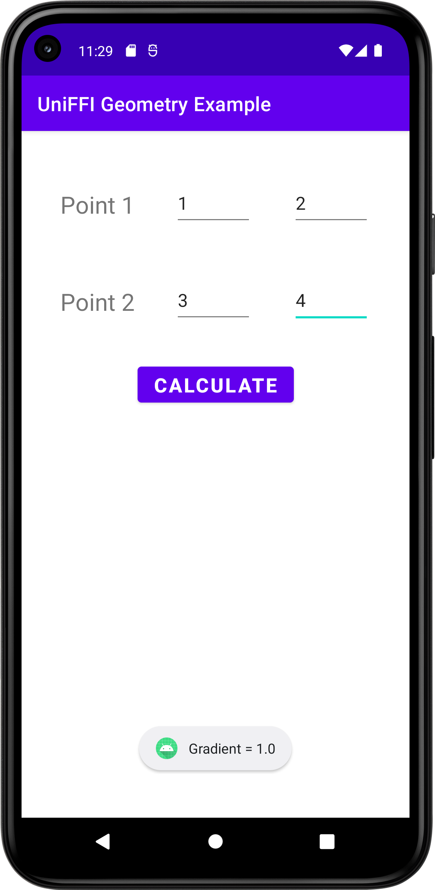

# uniffi-android
A basic app to generate uniffi bindings and run it in an android application.

The business logic was obtained from [here](https://github.com/mozilla/uniffi-rs/tree/main/examples/geometry).

## Usage
Inside the `geometry` dir, run this to generate the **Kotlin** bindings.
```bash
cargo build --release --target x86_64-linux-android --target i686-linux-android --target armv7-linux-androideabi --target aarch64-linux-android
```

This will generate jni binaries inside the `target` directory. The next command can be used to copy these binaries into a ABI compliant directory (rename also).
```bash
mkdir -p jniLibs/arm64-v8a/ && \
  cp target/aarch64-linux-android/release/*.so jniLibs/arm64-v8a/libuniffi_geometry.so && \
  mkdir -p jniLibs/armeabi-v7a/ && \
    cp target/armv7-linux-androideabi/release/*.so jniLibs/armeabi-v7a/libuniffi_geometry.so && \
  mkdir -p jniLibs/x86/ && \
    cp target/i686-linux-android/release/*.so jniLibs/x86/libuniffi_geometry.so && \
  mkdir -p jniLibs/x86_64/ && \
    cp target/x86_64-linux-android/release/*.so jniLibs/x86_64/libuniffi_geometry.so
```

Generate the Kotlin bindings.
```bash
cargo run --features=uniffi/cli --bin uniffi-bindgen generate src/geometry.udl --language kotlin
```

After creating your android application
1. Add JNA deps
```
// ...
    implementation "net.java.dev.jna:jna:5.13.0@aar"
// ...
```

2. copy:
- `geometry/jniLibs` -> `app/src/main`
- `geometry/src/uniffi` -> `app/src/main/java`

3. Now on the Android application, you should be able to access the uniffi lib using `uniffi.geometry`.

## Application
This application takes in coordinates for two points and calculates its gradient and displays as a toast.

### Screenshots

